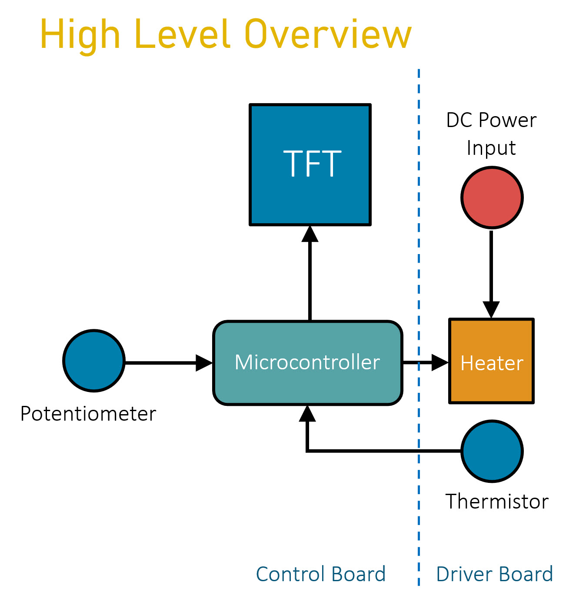
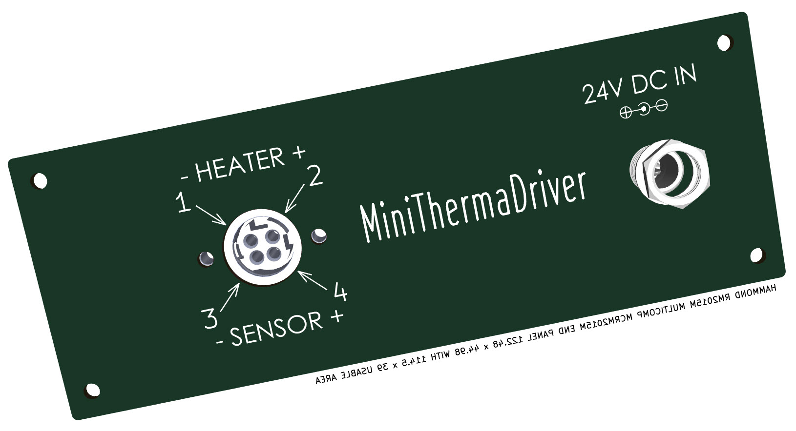
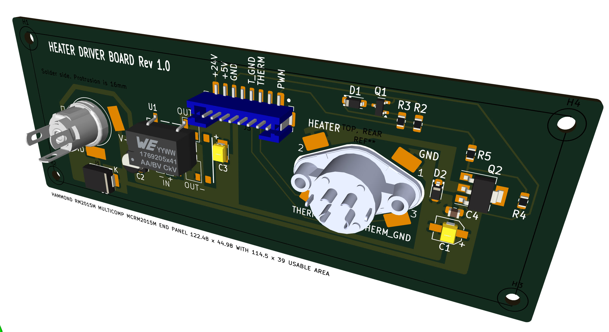
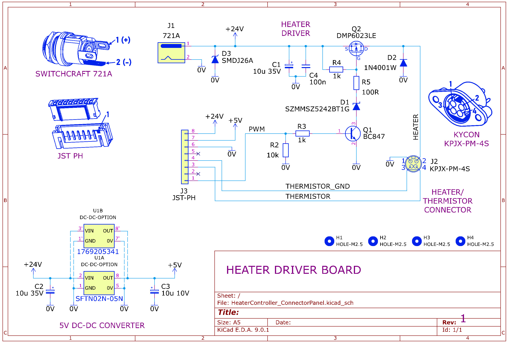

# MiniThermaDrive

A controller for heating small objects to user-defined temperatures.

## Overview

This repository contains a project for controlling a small heating element, with feedback using a thermistor. The system provides precise temperature control for various applications.

## Applications

The project is applicable for a variety of uses, including:
- Heating small leather tools
- Warming up a 3D printer bed
- Any application requiring controlled heating of small objects

## Hardware

The element and thermistor happen to be low-cost 3D printer spares, making this an affordable solution for temperature-controlled heating applications.

The project is built on two circuit boards; a Driver Board, and a Control Board.

## Driver Board

The Driver Board provides connections to the heater element, sensor (thermistor) and to the 24V DC input.

The other side of the Driver Board contains the driver circuitry (a MOSFET), and a 5V DC supply, for powering the microcontroller on the Control Board.

The Driver Board connects to the Control Board using an 8-way JST-PH connector cable.

Driver Board circuit diagram:

## Control Board

TBD. 

The Control board contains the microcontroller, and the user interface (a rotary potentiometer for setting the desired temperature, and a little TFT screen for displaying the set temperature, and the actual temperature). 

